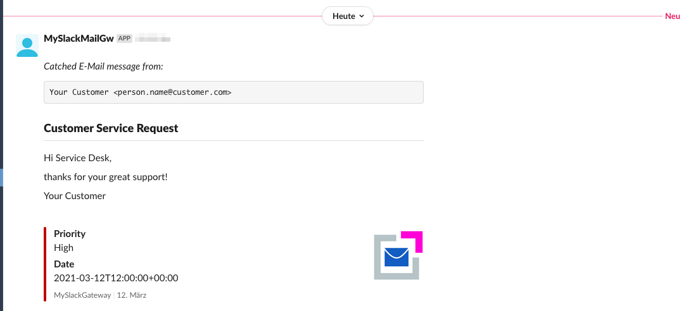
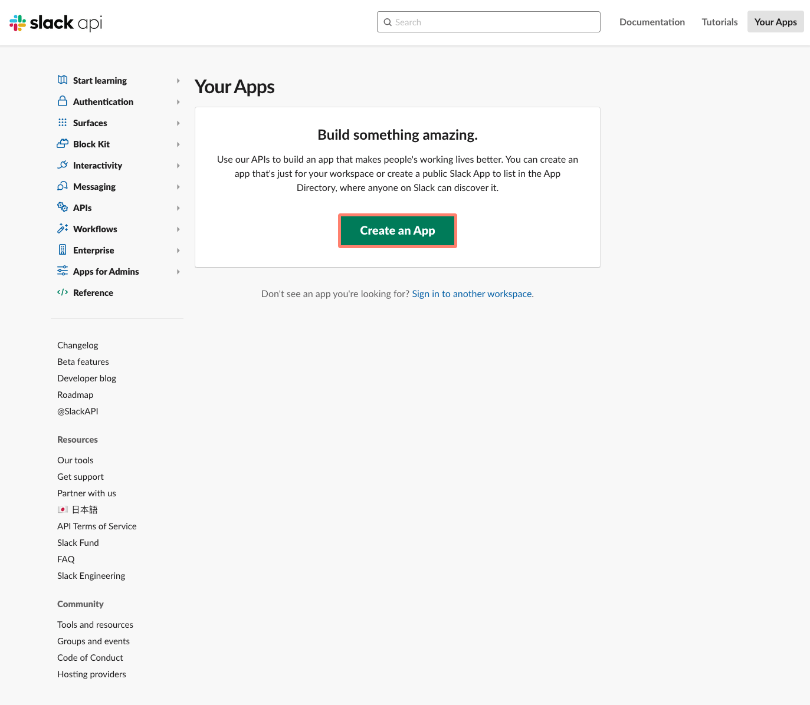
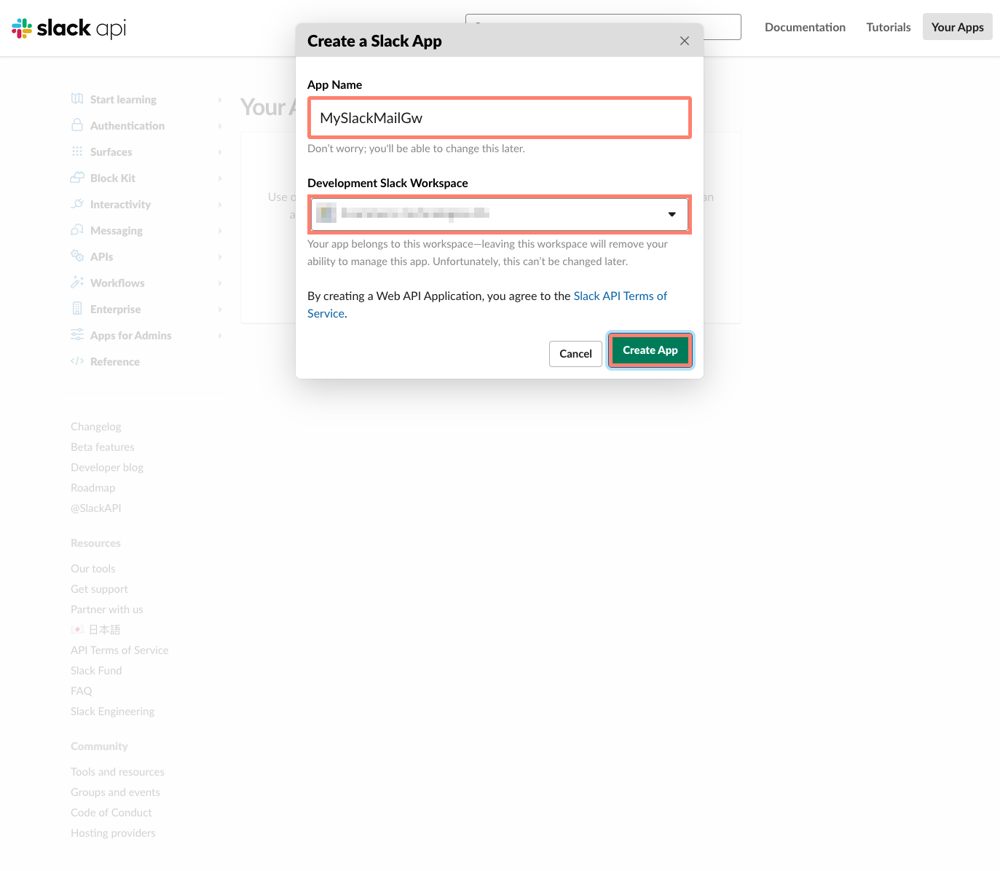
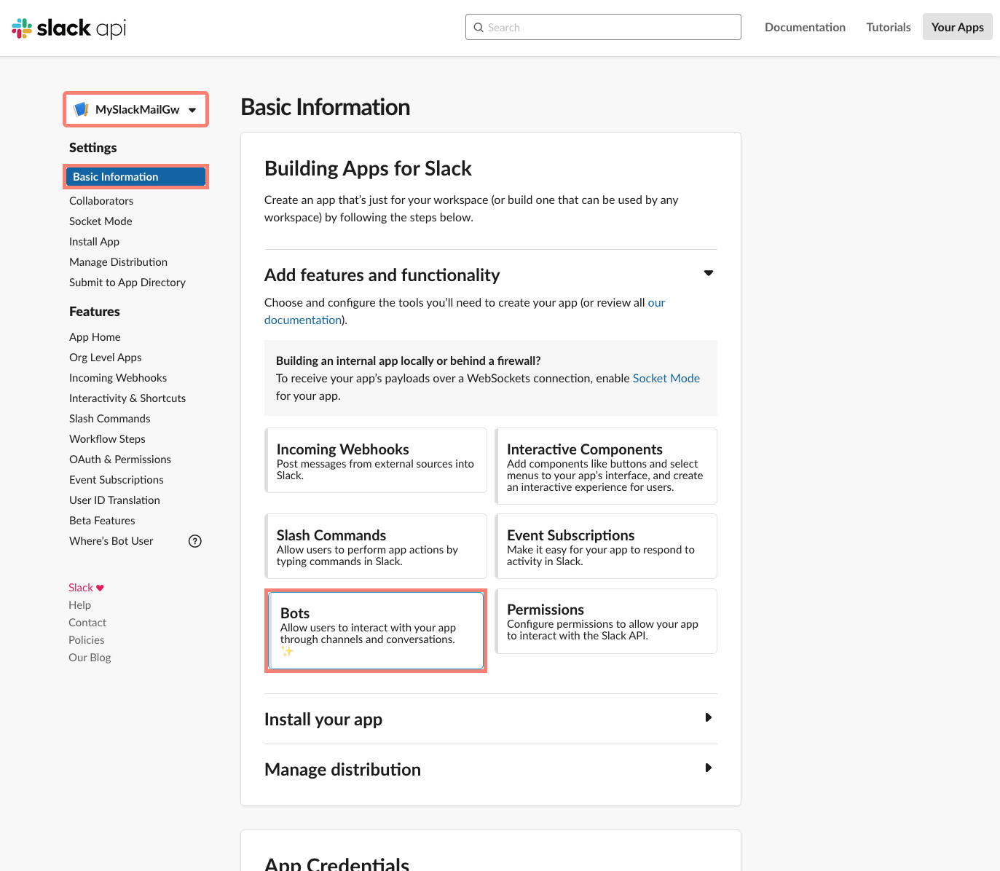
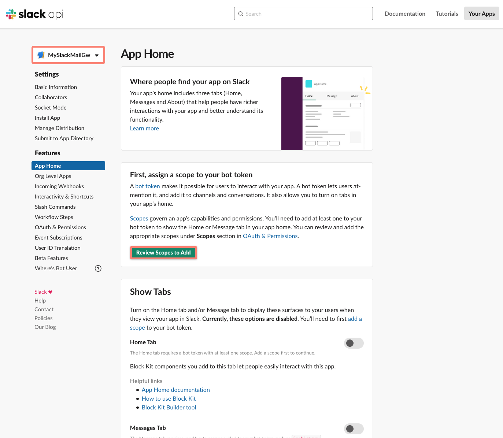
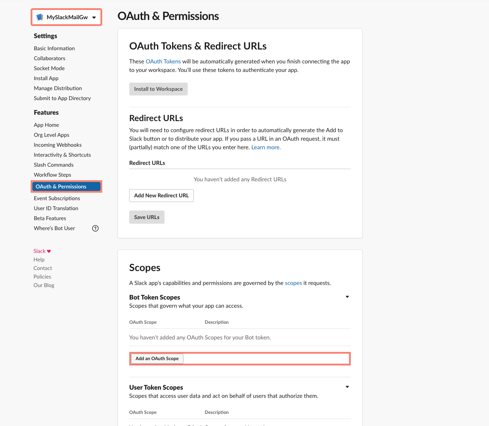
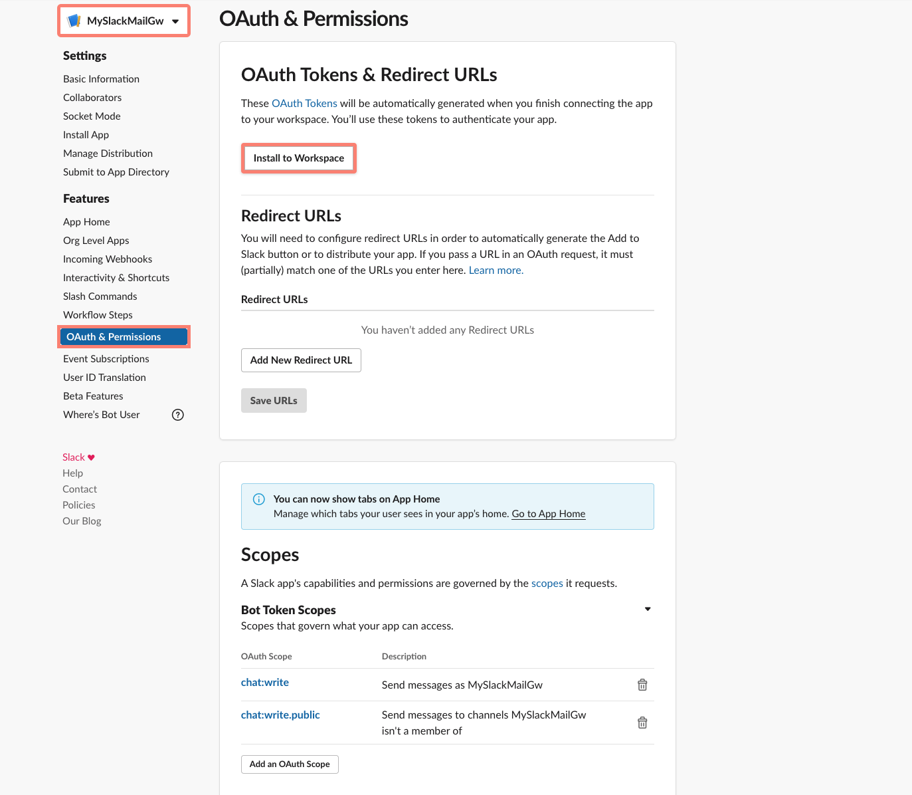
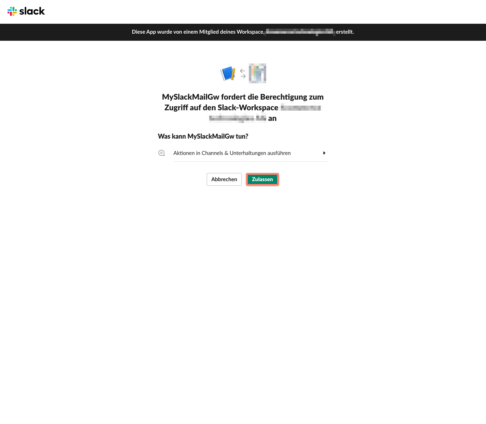
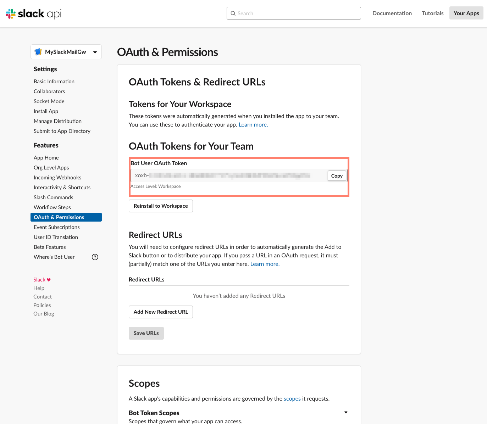

<h2>Slack Mail Gateway</h2>

The Slack Mail Gateway recipe allows you to run a mail server gateway on _localhost_ at port _2525_ to forward any incoming mail into a defined slack channel.

The incoming message is parsed and the sender (name and address), the subject and message text will be shown in slack channel. To full-fill the information, also the date is taken from the email and transmitted when pushed to slack channel. The message text will be extracted from multipart text or html or simple message body.



Have fun to use and extend this recipe for your own ideas and needs.

<br>

### Prepare slack webhook

Before you may forward emails to your slack channel, you have to create an API token to one of your workspaces. Log into your slack account and open the [api.slack.com/apps](https://api.slack.com/apps).



Press button **create new App** and define a name for your app and select your workspace.



After having created the new app, please click on **Bots**.



You are ready to configure your **App Scopes**.



You need to **Add** _OAuth Scopes_ and **Install To Workspace** (page top).



Select **Add** _chat:write_ and _chat:write:public_ to the scopes.


The API gets an **authorization** to the workspace when **Installed**.



Apply the **authorization** to publish messages to the selected **workspace**.



When finished the above, you will get the **API token** and may copy it to clipboard. The token is necessary on follow-up.



Your slack app is ready to receive messages.

<br>

### Source code

Use the following source code template as your SMTP Slack Gateway. Follow **Usage** for how to use.

```rb
# frozen_string_literal: true

require 'midi-smtp-server'
require 'slack-ruby-client'
require 'mail'
require 'oga'

# get the slack endpoint from ENV var
Slack.configure do |config|
  config.token = ENV['SLACK_API_TOKEN']
  raise 'Missing env SLACK_API_TOKEN setting for startup!' if config.token.to_s.empty?
end

# check setting for slack channel
raise 'Missing env SLACK_POST_CHANNEL setting for startup!' if ENV['SLACK_POST_CHANNEL'].to_s.empty?

# Server class
class MySlackMailGw < MidiSmtpServer::Smtpd

  # to get a readable source code, use the nbsp method
  def nbsp
    [160].pack('U*')
  end

  # build a layout block for messages
  def slack_block_kit(block_type:, content_type:, content:)
    {
      type: block_type,
      text: {
        type: content_type,
        text: content
      }
    }
  end

  # build a layout block for messages
  def slack_block_kit_header_text(content)
    slack_block_kit(block_type: 'header', content_type: 'plain_text', content: content)
  end

  # build a layout block for messages
  def slack_block_kit_header_mrkdwn(content)
    slack_block_kit(block_type: 'header', content_type: 'mrkdwn', content: content)
  end

  # build a layout block for messages
  def slack_block_kit_section_text(content)
    slack_block_kit(block_type: 'section', content_type: 'plain_text', content: content)
  end

  # build a layout block for messages
  def slack_block_kit_section_mrkdwn(content)
    slack_block_kit(block_type: 'section', content_type: 'mrkdwn', content: content)
  end

  # build a layout block for messages
  def slack_block_kit_divider
    { type: 'divider' }
  end

  # get each message after DATA <message> .
  def on_message_data_event(ctx)
    # Output for debug
    logger.debug("mail received at: [#{ctx[:server][:local_ip]}:#{ctx[:server][:local_port]}] from: [#{ctx[:envelope][:from]}] for recipient(s): [#{ctx[:envelope][:to]}]...")

    # Just decode message ones to make sure, that this message is usable
    mail = Mail.read_from_string(ctx[:message][:data])

    # check for text message
    if mail.text_part
      # use only plain text message
      s_text = mail.text_part.body
    elsif mail.html_part
      # extract text from html message
      doc = Oga.parse_html(mail.html_part.body.to_s.encode('UTF-8', invalid: :replace, undef: :replace, replace: '').delete("\000"))
      # index to body node
      body_node = doc.xpath('/html/body').first
      # get plain text from dom
      s_text = body_node.text.strip if body_node
    else
      # use the simple decoded body
      s_text = mail.body.decoded
    end

    # open channel to slack api
    slack_client = Slack::Web::Client.new

    # check authentication
    slack_client.auth_test

    # post message to channel
    slack_client.chat_postMessage(
      # define channel to post to
      channel: ENV['SLACK_POST_CHANNEL'],
      # simple text left empty
      text: '',
      # build message from blocks
      blocks: [
        slack_block_kit_section_mrkdwn("#{nbsp}\n_Captured E-Mail message from:_\n\n```#{mail[:from]}```"),
        slack_block_kit_header_text("#{mail[:subject]}"),
        slack_block_kit_divider,
        slack_block_kit_section_text(s_text.to_s.force_encoding('UTF-8')),
        slack_block_kit_section_text("#{nbsp}")
      ],
      # append some additional information as attachments
      attachments: [
        {
          color: mail.header['X-Priority'].to_s.match?(/[^0-9]*1[^0-9]*/) ? '#b60707' : '#0c91b6',
          fields: [
            { title: 'Priority', short: false, value: mail.header['X-Priority'].to_s.match?(/[^0-9]*1[^0-9]*/) ? 'High' : 'Normal / Low' },
            { title: 'Date', short: false, value: mail.date }
          ],
          text: '',
          thumb_url: 'https://4commerce-technologies-ag.github.io/midi-smtp-server/img/midi-smtp-server-logo.png',
          footer: 'MySlackMailGw',
          ts: mail.date.to_time.to_i - mail.date.to_time.utc_offset
        }
      ]
    )

    # handle incoming mail, just show the message source
    logger.debug('message was pushed to slack')
  end

end

# Create a new server instance for listening
# If no ENV settings use default interfaces 127.0.0.1:2525
# Attention: 127.0.0.1 is not accessible in Docker container even when ports are exposed
server = MySlackMailGw.new(
  ports: ENV['SLACK_GW_PORTS'] || MidiSmtpServer::DEFAULT_SMTPD_PORT,
  hosts: ENV['SLACK_GW_HOSTS'] || MidiSmtpServer::DEFAULT_SMTPD_HOST,
  max_processings: ENV['SLACK_GW_MAX_PROCESSINGS'].to_s.empty? ? MidiSmtpServer::DEFAULT_SMTPD_MAX_PROCESSINGS : ENV['SLACK_GW_MAX_PROCESSINGS'].to_i,
  auth_mode: :AUTH_OPTIONAL,
  tls_mode: :TLS_FORBIDDEN,
  logger_severity: ENV['SLACK_GW_DEBUG'].to_s.empty? ? Logger::INFO : Logger::DEBUG
)

# save flag for Ctrl-C pressed
flag_status_ctrl_c_pressed = false

# try to gracefully shutdown on Ctrl-C
trap('INT') do
  # print an empty line right after ^C
  puts
  # notify flag about Ctrl-C was pressed
  flag_status_ctrl_c_pressed = true
  # signal exit to app
  exit 0
end

# Output for debug
server.logger.info("Starting MySlackMailGw [#{MidiSmtpServer::VERSION::STRING}|#{MidiSmtpServer::VERSION::DATE}] ...")

# setup exit code
at_exit do
  # check to shutdown connection
  if server
    # Output for debug
    server.logger.info('Ctrl-C interrupted, exit now...') if flag_status_ctrl_c_pressed
    # info about shutdown
    server.logger.info('Shutdown MySlackMailGw...')
    # stop all threads and connections gracefully
    server.stop
  end
  # Output for debug
  server.logger.info('MySlackMailGw down!')
end

# Start the server
server.start

# Run on server forever
server.join
```

<br>

Used libraries:

* [Github/slack-ruby/slack-ruby-client](https://github.com/slack-ruby/slack-ruby-client)
* [Github/mikel/mail](https://github.com/mikel/mail)

<br>

### Usage

To start your forwarding Slack Mail Gateway just run:

```sh
$ export SLACK_API_TOKEN="xoxb-..."
$ export SLACK_POST_CHANNEL)="#random"
$ ruby service/midi-smtp-server-recipe-slack-mta.rb
```

You may send now emails via smtp mail client or bridge to _localhost:2525_ to forward your messages into your Slack channels.

**Incoming message example**


<br>

!!! Note

    The source code is available at [Github/MidiSmtpServer/Cookbook/RecipeSlack/src/Service](https://github.com/4commerce-technologies-AG/midi-smtp-server/tree/master/cookbook/recipe-slack/src/service).

<br>

!!! Tip

    There is a Docker template to easily build and run a full service. The Dockerfile and code is available at [Github/MidiSmtpServer/Cookbook/RecipeSlack](https://github.com/4commerce-technologies-AG/midi-smtp-server/tree/master/cookbook/recipe-slack).

<br>

!!! Warning

    To run MySlackMailGw server in your own environment, you may need to install the additional gems via `gem install` or `bundle install`.

<br>
