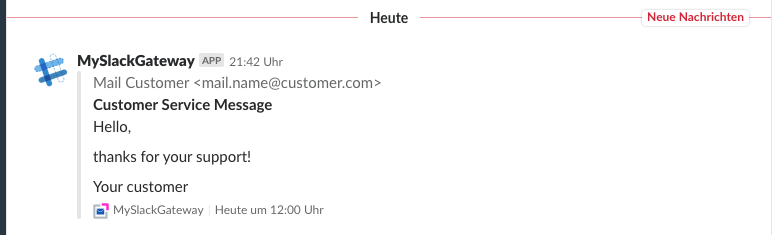
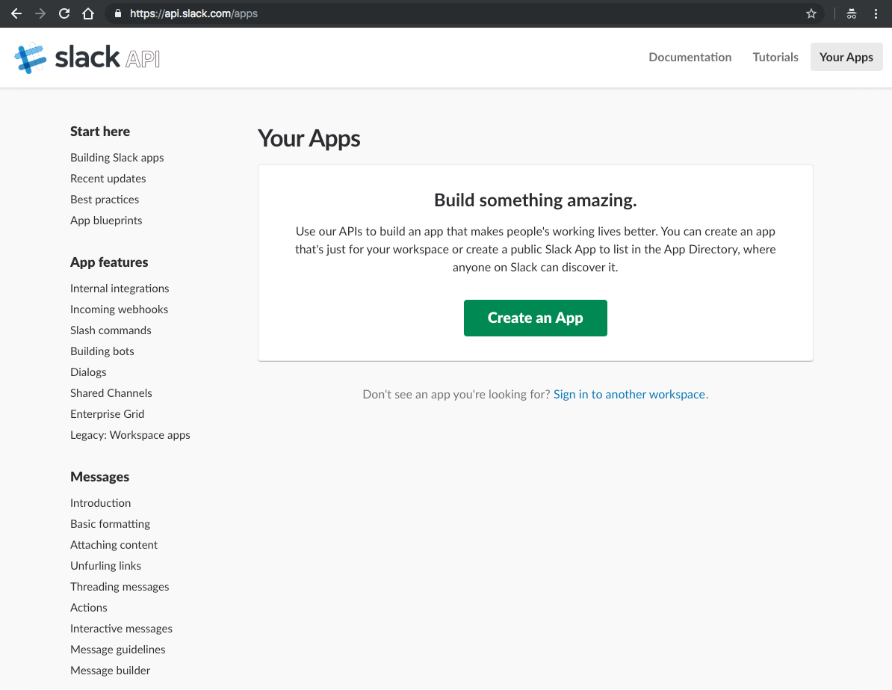
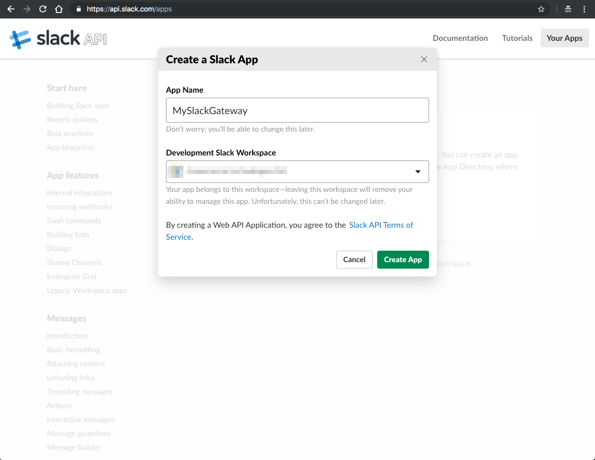
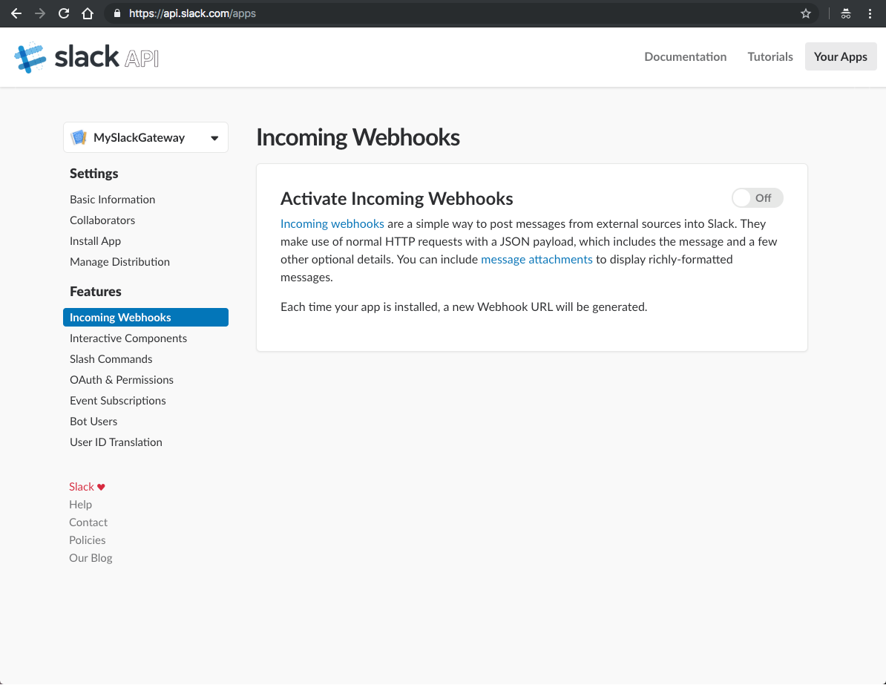
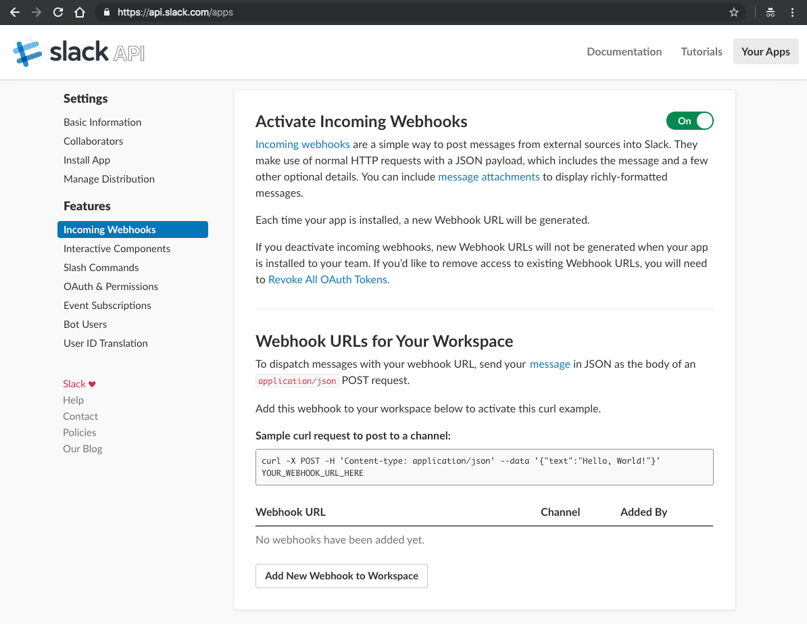
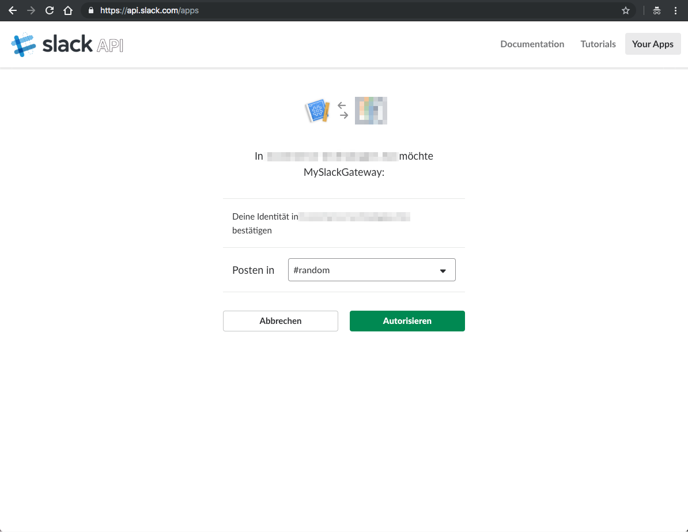
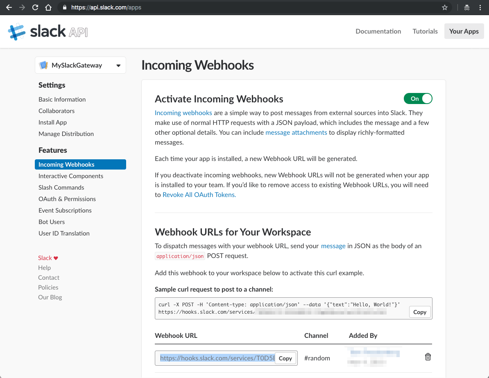

<h2>Slack MTA</h2>

The Slack MTA recipe allows you to run a mail server gateway on _localhost_ at port _2525_ to forward any incoming mail into a defined slack channel.

The incoming message is parsed and the sender (name and address), the subject and message text will be shown in slack channel. To full-fill the information, also the date is taken from the email and transmitted when pushed to slack channel. The message text will be extracted from multipart text or html or simple message body.



Have fun to use and extend this recipe for your own ideas and needs.

<br>

### Prepare slack webhook

Before you may forward emails to your slack channel, you have to create a webhook to one of your workspaces. Log into your slack account and open the [api.slack.com/apps](https://api.slack.com/apps).



Press button **create new App** and define a name for your app and select your workspace.



After having created the new app, please select **Incoming Webhooks** from sidebar.



You need to **Activate** _Incoming Webhooks_ and **Add New Webhook To Workspace** (page bottom).



The webhook wants an **authorization** to publish messages to the select **channel**.



When finished the above, you will get the **Webhook URL** and may copy it to clipboard. The URL is necessary on follow-up.



Your slack webhook is ready to receive messages.

<br>

### Source code

Use the following source code template as your SMTP Slack Gateway. Follow **Usage** for how to use.

```rb
require 'midi-smtp-server'
require 'slack-notifier'
require 'mail'
require 'oga'

# get the slack endpoint from ENV var
SLACK_WEBHOOK = ENV['SLACK_WEBHOOK'].freeze

# check for valid settings
raise 'Missing SLACK_WEBHOOK env setting for startup.' if SLACK_WEBHOOK.to_s == ''

# Server class
class MySlackGateway < MidiSmtpServer::Smtpd

  # get each message after DATA <message> .
  def on_message_data_event(ctx)
    # Output for debug
    logger.debug("mail reveived at: [#{ctx[:server][:local_ip]}:#{ctx[:server][:local_port]}] from: [#{ctx[:envelope][:from]}] for recipient(s): [#{ctx[:envelope][:to]}]...")

    # Just decode message ones to make sure, that this message is usable
    @mail = Mail.read_from_string(ctx[:message][:data])

    # check for text message
    if @mail.text_part
      # use only plain text message
      s_text = @mail.text_part.body
    elsif @mail.html_part
      # extract text from html message
      doc = Oga.parse_html(@mail.html_part.body.to_s.encode('UTF-8', invalid: :replace, undef: :replace, replace: '').delete("\000"))
      # index to body node
      body_node = doc.xpath('/html/body').first
      # get plain text from dom
      s_text = body_node.text.strip if body_node
    else
      # use the simple decoded body
      s_text = @mail.body.decoded
    end

    # open channel to slack webhook
    slack_notifier = Slack::Notifier.new SLACK_WEBHOOK

    # post message to channel
    slack_notifier.post \
      attachments: [
        {
          author_name: @mail[:from],
          title: @mail.subject,
          text: s_text.to_s.force_encoding('UTF-8'),
          footer: 'MySlackGateway',
          footer_icon: 'https://4commerce-technologies-ag.github.io/midi-smtp-server/img/midi-smtp-server-logo.png',
          ts: @mail.date.to_time.to_i - @mail.date.to_time.utc_offset
        }
      ]

    # handle incoming mail, just show the message source
    logger.debug('message was pushed to slack')
  end

end

# try to gracefully shutdown on Ctrl-C
trap('INT') do
  puts 'Interrupted, exit now...'
  exit 0
end

# Output for debug
puts "#{Time.now}: Starting MySlackGateway [#{MidiSmtpServer::VERSION::STRING}|#{MidiSmtpServer::VERSION::DATE}] ..."

# Create a new server instance listening at localhost interfaces 127.0.0.1:2525
# and accepting a maximum of 4 simultaneous connections
server = MySlackGateway.new

# setup exit code
at_exit do
  # check to shutdown connection
  if server
    # Output for debug
    puts "#{Time.now}: Shutdown MySlackGateway..."
    # stop all threads and connections gracefully
    server.stop
  end
  # Output for debug
  puts "#{Time.now}: MySlackGateway down!\n"
end

# Start the server
server.start

# Run on server forever
server.join
```

<br>

!!! Warning

    To run MySlackGateway server you have to install `midi-smtp-server`, `slack-notifier`, `mail` and `oga` gems via `gem install` or `bundler`.

<br>

### Usage

To start your forwarding Slack MTA just run:

```sh
$ export SLACK_WEBHOOK='https://hooks.slack.com/YOUR_WEBHOOK'
$ ruby cookbook/midi-smtp-server-cookbook-slack-mta.rb
```

You may send now emails via smtp mail client or bridge to _localhost:2525_ to forward your messages into your Slack channels.

**Incoming message example**


<br>

!!! Note

    The source code is available at [Github/MidiSmtpServer/Cookbook](https://github.com/4commerce-technologies-AG/
    midi-smtp-server/blob/master/cookbook/midi-smtp-server-recipe-slack-mta.rb).

<br>
